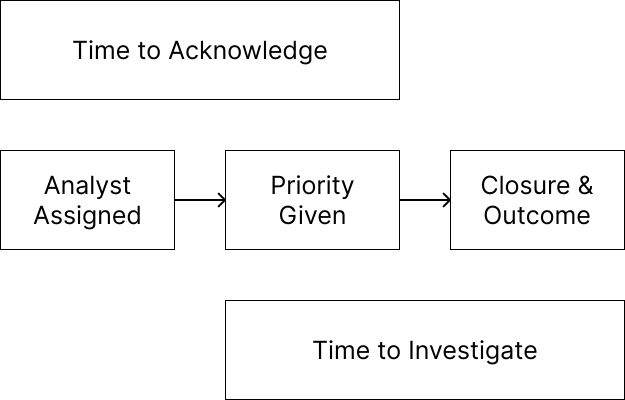

Below is an explanation of each page in this reporting app.

***

### Visibility

The visibility page provides historical data for metrics such as host severity, hosts observed, and hosts with detections. 

Every time the app refreshes, it takes a snapshot of the Hosts page within Cognito and stores the data into .csvs in the `logs/` folder. These historical logs are then used to produce the visibility page.

***

### TTD

The TTD tracks your organizations' time to detect, defined as the time between a detection firing and an analyst being assigned to it. It uses the detection's first timestamp and the timestamp of an assignment being added to a detection.

This page uses assignments to *detections*, not assignments to *hosts*.

***

### TTR

This page shows time to respond metrics. TTR is split into two parts: time to acknowledge and time to investigate. This page first shows TTR, then TTA and TTI.

The visual below can explain how TTA and TTI make up the two halves of TTR.

